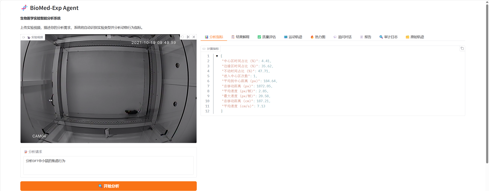
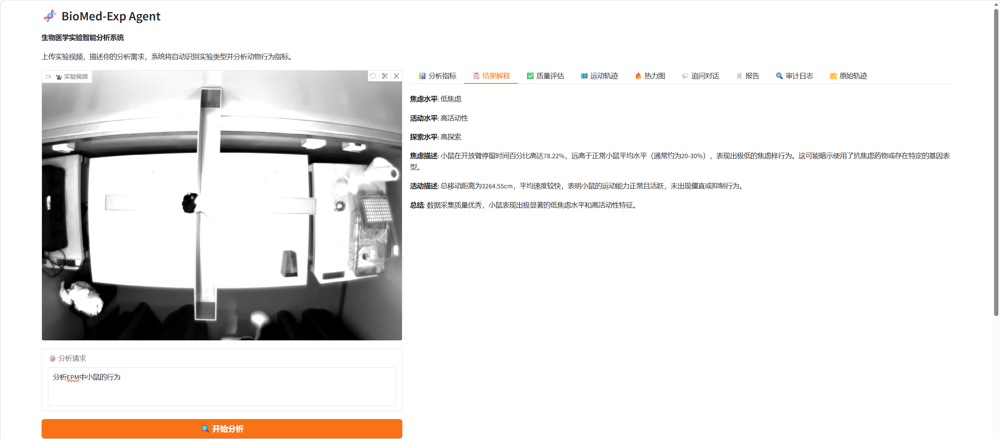
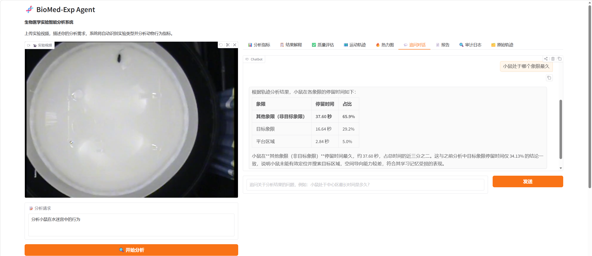
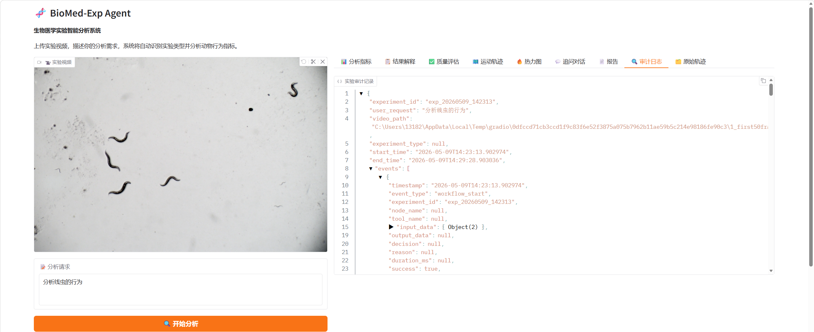
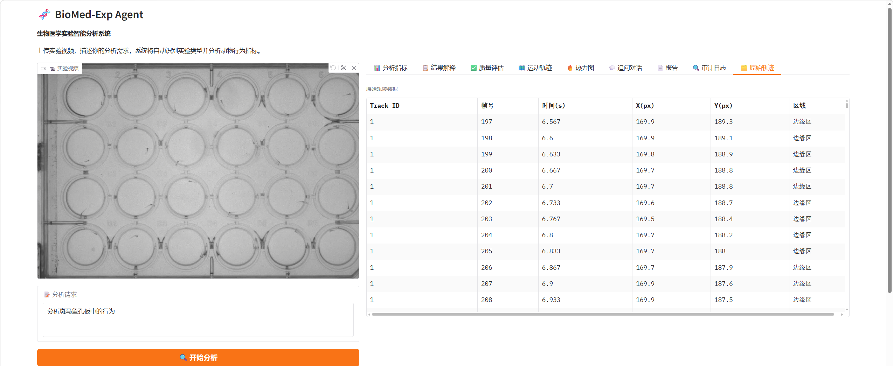
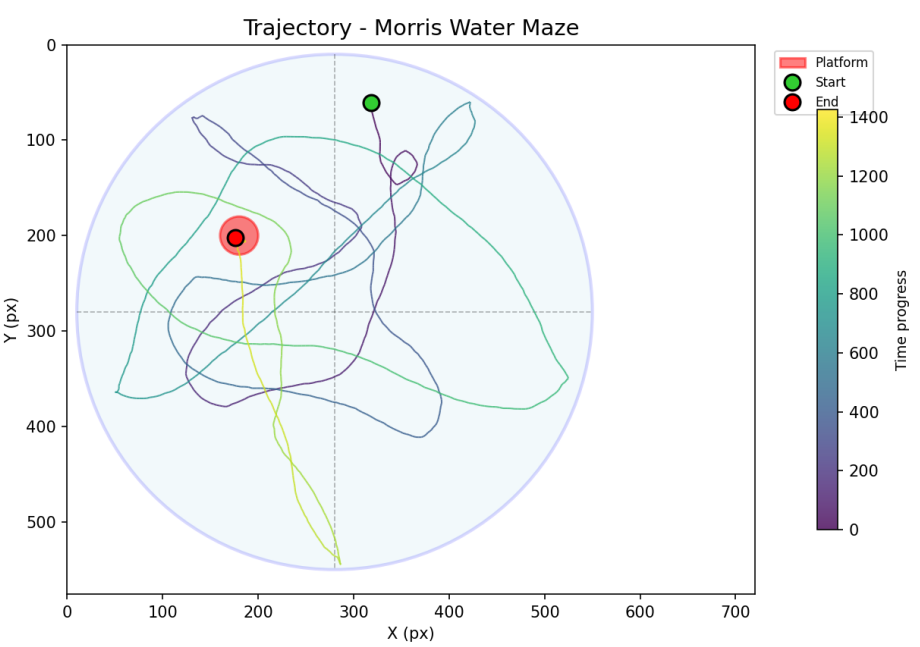
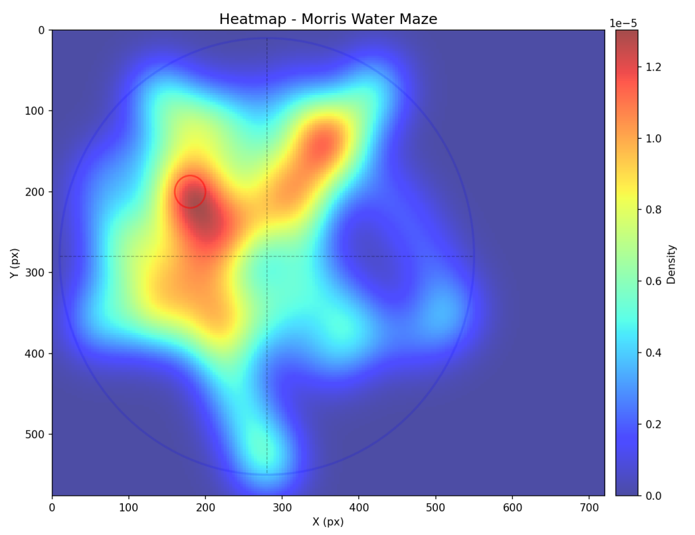

# BioMed-Exp Agent

基于大语言模型的**生物医学实验行为分析智能体系统**，支持自然语言驱动的多物种实验视频分析，涵盖轨迹跟踪、行为指标计算、可视化与报告生成。

## 特性

- **自然语言驱动**: 一句话描述分析需求，系统自动识别实验类型和物种
- **多物种支持**: 小鼠、大鼠、线虫（C. elegans）、斑马鱼
- **多实验类型**:
  - 旷场实验 (Open Field) — 焦虑与探索行为
  - 高架十字迷宫 (EPM) — 焦虑行为
  - Morris 水迷宫 (MWM) — 空间学习与记忆
  - 线虫行为分析 — 运动能力、神经表型
  - 斑马鱼孔板实验 — 药物运动影响、应激反应
- **自主修复**: 自动检测质量问题（检测率、跟踪连续性）并调整策略
- **经验复用**: 基于 SQLite 的长期记忆，相似实验自动复用历史策略
- **报告生成**: 支持 Markdown 报告与 HTML/PDF 导出（浏览器打印）
- **追问对话**: 分析完成后可对结果进行自然语言追问，支持精确计算
- **审计日志**: 完整的实验执行记录，可追溯每个决策

## 快速开始

### 环境要求

- Python 3.10+
- uv (推荐) 或 pip
- CUDA 11.8+ (GPU 加速，可选)

### 安装

```bash
# 克隆项目
git clone <repository-url>
cd biomed-exp-agent

# 使用 uv 安装依赖 (推荐)
uv sync

# 或使用 pip
pip install -e ".[dev]"
```

### 配置

```bash
# 复制环境变量模板
cp .env.example .env

# 编辑 .env 填入 LLM API Key (支持 GLM、Kimi 等)
# GLM_API_KEY=your_key_here
# GLM_MODEL=glm-4-flash
```

### 运行 Web UI

```bash
# 启动 Gradio 界面
uv run python src/ui/app.py

# 或显式指定端口
uv run python src/ui/app.py --server_port 7861
```

### 运行 API 服务

```bash
uvicorn src.api.main:app --reload --port 8000
```

## 使用流程

1. **上传视频**: 支持 MP4 格式实验视频
2. **描述需求**: 用自然语言描述分析目标，例如：
   - "分析小鼠在旷场实验中的焦虑行为"
   - "评估水迷宫实验中小鼠的空间学习能力"
   - "分析线虫的运动行为和弯曲模式"
3. **查看结果**: 系统自动完成检测 → 跟踪 → 指标计算 → 可视化
4. **生成报告**: 在"报告"Tab 中选择板块，生成 Markdown/HTML 报告
5. **导出 PDF**: 下载 HTML 报告后用浏览器打印为 PDF
6. **追问分析**: 在"追问对话"Tab 中用自然语言深入探索数据

## 运行效果

系统提供多个功能，支持从不同维度查看和交互分析结果：

<p align="center">
  
  <br/>
  <sub>分析指标 — 旷场实验行为指标汇总与解读</sub>
</p>

<p align="center">
  
  <br/>
  <sub>结果解释 — 高架十字迷宫实验结果分析与意义说明</sub>
</p>

<p align="center">
  
  <br/>
  <sub>追问对话 — 莫里斯水迷宫实验的交互式追问与回答</sub>
</p>

<p align="center">
  
  <br/>
  <sub>审计日志 — 线虫实验完整执行记录与质量评估</sub>
</p>

<p align="center">
  
  <br/>
  <sub>原始轨迹 — 斑马鱼孔板实验运动轨迹</sub>
</p>

<p align="center">
  
  <br/>
  <sub>可视化 — 运动轨迹图</sub>
</p>

<p align="center">
  
  <br/>
  <sub>可视化 — 空间密度热力图</sub>
</p>

## 项目结构

```
biomed-exp-agent/
├── src/
│   ├── agent/          # LangGraph 工作流 (感知-规划-执行-反思)
│   │   ├── nodes/      # 工作流节点 (perceive, plan, execute, reflect)
│   │   ├── memory/     # 长期记忆存储 (SQLite)
│   │   └── prompts/    # LLM Prompt 模板
│   ├── tools/          # 分析工具链
│   │   ├── detect.py   # 目标检测 (YOLO / 颜色阈值)
│   │   ├── track.py    # 目标跟踪 (SORT / 孔位分割跟踪)
│   │   ├── segment.py  # SAM 图像分割
│   │   ├── skeleton.py # 线虫骨架提取
│   │   ├── calculate.py # 行为指标计算
│   │   ├── visualize.py # 轨迹图 / 热力图 / 场地叠加
│   │   ├── report.py   # 报告生成 (Markdown / HTML)
│   │   ├── followup.py # 追问对话计算工具
│   │   ├── quality.py  # 质量评估器
│   │   └── server.py   # 工具服务封装
│   ├── scientific/     # 科学约束验证与审计日志
│   ├── llm/            # LLM 客户端封装
│   ├── api/            # FastAPI 服务
│   └── ui/             # Gradio Web 界面
├── notebooks/          # Jupyter 调试
├── docs/               # 文档
├── data/               # 本地数据 (SQLite 记忆库)
├── weights/            # 模型权重 (YOLO / SAM)
└── videos/             # 实验视频
```

## 技术栈

| 组件 | 技术 |
|------|------|
| Agent 框架 | LangGraph (感知-规划-执行-反思循环) |
| LLM 提供商 | GLM (智谱 AI)、Kimi (Moonshot) |
| 目标检测 | YOLO26、颜色阈值法 (MWM) |
| 目标跟踪 | SORT |
| 图像分割 | SAM (Segment Anything) |
| 记忆层 | SQLite + SQLModel |
| API 框架 | FastAPI |
| UI 框架 | Gradio |
| 包管理 | uv |

## License

MIT
